# Neural Architecture Search with Deep Reinforcement Learning

## Motivation
> [](http://www.youtube.com/watch?v=wL-p5cjDG64)
> 
> Placeholder for video summary
> 
> [Link to paper](https://openreview.net/pdf?id=r1Ue8Hcxg "Paper link")
> 
> Placeholder for paper summary

## REINFORCE Algorithm

As previously stated the core of this project is to show the power of reinforcement learning, more specifically deep
reinforcement learning. That is a combination of the most currently relevant AI fields which are Deep Learning and
Reinforcement learning. Deep learning is one of the most useful tools because it can quicly adapt to every kind of problem
nature, from most complex to most simple, as long as large amount of data is given to them, so they can learn, whilst other
ML learning models can behave well only in certain environments, under certain conditions. However, from there we can deduct
a crucial point when using neural networks. That is no matter how good they are  and how fast they adapt, that is only possible
if large amount of data is given.

The deep reinforcement learning field basically can be divided in two types of algorithms, and those are `policy-based` and
`value-gradient` methods.


Every RL based type of learning has only one goal, and that is to maximize the "expected" reward throughout the learning process. However,
the difference in all the algorithm 

> Placeholder for REINFORCE algorithm explanation summary


## 3. Problem formalization

The core idea of our project is to automate the neural network design process, regardless the nature of the problem for which the proposed
network model will be used for. Since we decided to propose a solution with the use of deep reinforcement learning the problem needs to be 
modeled as a MDP(Markov Decision Process) problem. But before we even model it as that, we needed to make sure that the problem satisfies 
the conditions to be considered as a MDP problem. Generally there are two conditions:

    - The `Markov property` - the future is independent of the past if we know the current state
                                - In our problem the state (in detailed explained in section 3.1.) is a neural network model
                                  which is proposed for the dataset atm. When we take an action we modify one of three neural
                                  network properties(number of layers, hidden size or learning rate). The modifications are
                                  applied to the current state(neural network) model.
                                    ex. Current model has:
                                        - number of layers: 2
                                        - hidden size: 10
                                        - learning rate: 0.001
                                        Choosing random action: number of layers (incremented by 1)
                                        New state will be:
                                        - number of layers: 3 (only this property has been changed)
                                        - hidden size: 10
                                        - learning rate: 0.001
                                Therefore, the next state is determined only by the current state and chosen action, there is no need
                                to keep track of states from the initial state till now.
    - The `Markov process` - sequence of states that obey the `Markov property`
                                - It is clear by the first point that the states modeled as they are in our problem adapt the rules
                                  of the `Markov property`

Since we have proved that the nature of the problem satisfies the MDP problem conditions it's time to define the MDP by defining:
- set of **States** (section 3.1.)
    - start/initial state
    - (possibly) terminal state
- set of **Actions** (section 3.2.)
- **Transition function** (section 3.3.)
- **Rewards (and possibly discount)** (section 3.4.)


###  3.1. State

A state is represented by a set of parameters for the neural network, to create a neural network suitable for the given
dataset. We keep track of more parameters and those are:

| Parameter              | Description                                                                                                                                                                                                                                                                                                                                                                                               |
|------------------------|-----------------------------------------------------------------------------------------------------------------------------------------------------------------------------------------------------------------------------------------------------------------------------------------------------------------------------------------------------------------------------------------------------------|
| **number of classes**  | This parameter as strictly derived from the dataset it is currently the object of observing. Considering we are only taking care of classification problem. this would be the number of target classes in the dataset itself.                                                                                                                                                                             |
| **number of features** | This parameter like the previous as well can be derived from dataset i.e. the number of attributes we can learn from.                                                                                                                                                                                                                                                                                     |
| **number of layers**   | Considering the state reflects the current neural network model which is proposed as a solution for evaluation, this property represents the number of layers in it. This is not a static property like the previous two properties which are ones initialized and stay the same. This is directly influenced by the actions(described in next section), which are supposed to modify the neural network. |
| **hidden size**        | The hidden size reflects the number of neurons in each layer of the proposed neural network. This likewise the `numbe of layers` and because of the same reasons it's not a static property and changes overtime.                                                                                                                                                                                         |
| **learning rate**      | This is the well-know and crucial hyperparameter of each neural networks, which while training controls how much to change the model in response to the estimated error each time the model weights are updated.                                                                                                                                                                                          |
| **convolutional size** | This is a special type of property, and it's only useful when working with image datasets. This parameter reflects the image size (width x height) in pixels. It is store as tuple of two values (width, height).                                                                                                                                                                                         |

Furthermore, from a programing point of view it is represented as a class with five attributes reflecting the mentioned ones:

```python
class State:
    def __init__(self, num_classes, num_features, num_layers, hidden_size, learning_rate, conv_size):
        super().__init__()
        self.num_layers = num_layers
        self.num_classes = num_classes
        self.num_features = num_features
        self.hidden_size = hidden_size
        self.learning_rate = learning_rate
        self.conv_ize = conv_size
```

#### 3.1.1. Start/initial state

As in every RL problem we define two types of states **initial** and **terminal** state.
Every run on a new dataset creates the initial state like the following:

    - number of classes - deducted from the dataset
    - number of features - deducted from the dataset
    - number of layers - initial value set to 1
    - hidden size - initial value set to 1
    - learning rate - initial value set to 0.0001
    - convolutional size - set by the developer when workinh with image dataset, `null` otherwise

#### 3.1.2. Terminal state

The terminal state in our problem is not an explicit one, but it can be considered implicitly. That is done by the 
`stop function`. The stop function has a `comparing property` which is either than two values **accuracy** or **loss**, 
and checks several stopping conditions regarding the `comparing property` we have chosen, so we can have a comparison
of the two stopping criteria which suits better for the problem. Either way it can be said that the ***terminal state 
is not an explicit state with known values to be achieved, but it is implicitly defined by the `stop function`***. (Details
about stop function in the corresponding section)

#### Stop function
> Placeholder for stop function summary


### 3.2. Actions

The actions in our project are represented as a set of changeable parameters for the neural network. The representation
is like the state, but the actions are constructed just of the parameters that can be changed and the performance is
dependent on them in the neural network. Every next possible action has a change in just one of the parameters from the
previous, consequently the number of the next possible actions from a current state is the number of parameters in the
action. We offer for set of actions:

| Action               | Description                                                                                                                     |
|----------------------|---------------------------------------------------------------------------------------------------------------------------------|
| **number of layers** | Number of layers in the neural network. This is only referring to the hidden layer, it is not including input and output layer. |
| **hidden size**      | Number of neurons in the hidden layers.                                                                                         |
| **learning rate**    | The learning rate with which the neural networks adapts to weights update during training.                                      |

In the project the actions are represented by class containing all three properties:

```python
class Actions:
    def __init__(self, num_layers, hidden_size, learning_rate):
        super().__init__()
        self.num_layers = num_layers
        self.hidden_size = hidden_size
        self.learning_rate = learning_rate
```

As we can see we are working with **discrete action space** of 3 actions, therefore it makes the environment of the project a **infinite discrete environment**,
stating we have an infinite number of states where we can act with discrete actions. Once an actions is chosen by our agent then we need to implement the action
in the following way:

    - number of layers - the corresponding property in the current state is incremented by 1
    - hidden size - the corresponding property in the current state is incremented by 1
    - learning rate - the corresponding property in the current state is incremented by 0.0001

From programming point of view it would look like this: 

```python
    def implement_action(self, action):
        """"sets the new current state implementing the action given as a parameter
         :param action object from the class Action"""
        attribute = self.action_decoding_dict.get(action)
        previous_value = self.current_state.__getattribute__(attribute)
        if attribute == "learning_rate":
            self.current_state.__setattr__(attribute, previous_value + 0.0001)
        else:
            self.current_state.__setattr__(attribute, previous_value + 1)
        self.actions = from_state_to_action(self.current_state)
```

### 3.3. Transition function

### 3.4. Rewards (and discount factor)


## Generator

The generator is providing the neural network models contracted by the current state updated in the current action.
Depending on the scale of the dataset and its features the generator provides a suitable model whose performance is
rewarded by the success of the training phase. The generator has two methods generating models one that generates feed
forward neural networks and the other one generates convolutional neural networks.

```sh
    def model_from_state(self, state):
    """
        Method generating a feed froward sequential neural network with the parameter from the state
        :param state - object from class State
        :return sequential keras model
    """
    
     def model_conv_from_state(self, state):
        """
        Method generating a convolutional neural network with the parameter from the state
        :param state - object from class State
        :return sequential keras model
        """


```

## Controller

The controller is the main part in which all the steps are taken and the logic is implemented. All parts of the
application are coming together and eventually communicating through its actions. During the initialization the values
for the initial state are given and the parameters for the reinforcement algorithm, also the dataset processing is
called and the processed dataset is used as a class parameter.

```shell
  def __init__(self, dataset_path, dataset_delimiter=",", dataset_image=False):
            super().__init__()
            self.dataset_path = dataset_path
            if dataset_image:
                self.dataSet = ImageDataSet(self.dataset_path, delimiter=dataset_delimiter)
            else:
                self.dataSet = Dataset(self.dataset_path, delimiter=dataset_delimiter)
            self.initial_state = State(self.dataSet.number_of_classes(),
                                       self.dataSet.number_of_features(), 1, 1, 0.0001,
                                       self.dataSet.complex_type_features())
            self.current_state = self.initial_state
            self.actions = from_state_to_action(self.initial_state)
            self.action_space = len(get_class_attributes(self.actions))
            self.generator = Generator()
            self.nas_environment = NASEnvironment(self.dataSet)
            self.policy = RLPolicyAgent(len(get_class_attributes(self.actions)), self.action_space)
            self.num_episodes = 2
            self.action_decoding_dict = self.create_action_dict()
            self.tensor_board_manager = TensorBoardCustomManager(name='ReinforceScalars')

```

All the methods and logic are implemented in the perform method, after initializing the controller the perform method is
called.

```shell
 def controller_preform(self):
        """
        Main function in the class calls all the methods in the class. 
        Preforms number of episodes and returns the best state.
        Makes call for the following methods: 
        - run_episode
        - controller_reset
        -policy train
        -policy memorize
        :return state
        """
       
  
```

## Data preprocessing

So far the project only works with standard datasets and image datasets. We created class abstractions in order to
process datasets. In the file `DatasetApstractions` there's a class called `Dataset` which only serves to process **
standard datasets** i.e. dataset in CSV format, which only consists of plain features and target class (whether is
multiple columns or not). Only input parametrs are the absolute path to where the dataset is stored, as well as the
delimiter used in the CSV file. A requirement for our `Dataset` class to works is that every column in the dataset
should be prefixed with `class_<column-name>` (ex. class_humidity), in order to recognize them when working with them.
Then for every dataset we have several methods out of the box:

```sh
    def number_of_features(self, result_type=ResultType.ENCODED)
	"""
        returns the number of features in the dataset specified with the result type
        :param result_type: Should the method be applied on the encoded dataset or plain dataset (type - ResultType)
        :return: number of features (type - Int)
    """

    def number_of_classes(self, result_type=ResultType.ENCODED)
	"""
        number of columns in the dataset specified with result_type which represent the target classes
        :param result_type: Should the method be applied on the encoded dataset or plain dataset (type - ResultType)
        :return: number of classes (type - Int)
    """

    def classes_names(self, result_type=ResultType.ENCODED)
	"""
        name of the columns which are the target classes in the dataset specified with the result_type
        :param result_type: Should the method be applied on the encoded dataset or plain dataset (type - ResultType)
        :return: list of names (type - List)
    """

    def feature_names(self, result_type=ResultType.ENCODED)
	"""
        returns the feature name in the dataset specified with the result_type
        :param result_type: Should the method be applied on the encoded dataset or plain dataset (type - ResultType)
        :return: list of feature names (type - List)
    """

    def split_data(self, result_type=ResultType.ENCODED, train_size=0.7, test_size=0.3)
	"""
        Splits the dataset specified with the result_type in 6 sets of values:
            1. train_data - default 70% from the dataset
            2. test_data - default 30% from the dataset
            3. train_data_features - only the features in train_data
            4. train_data_classes - only the classes in train_data
            5. test_data_features - only the features in test_data
            6. test_data_classes - only the classes in test_data
        :param result_type: Should the method be applied on the encoded dataset or plain dataset (type - ResultType)
        :param train_size: Percentage of dataset for training (default = 0.7 - 70%, type - Decimal)
        :param test_size: Percentage of dataset for testing (default = 0.3 - 30%, type - Decimal)
        :return: train_data_features, train_data_classes, test_data_features, test_data_classes, train_data, test_data
        (in the specified order, type - DataFrame)
    """
```
Those are some of the most important and many others. For example one of the most useful are `number_of_classes` and `number_of_features` in order
to build compatible ***Input*** and ***Output*** layer of the Neural Network model we are about to build.
As you can notice each method receives a parameter called result type which can have two possible values:
```sh
class ResultType(Enum):
    ENCODED = 1
    PLAIN = 2
```
When we process the dataset we keep two versions of the dataset one PLAIN(as it is) and one ENCODED with one hot encoding where every categorical value
is encoded accordingly.
Previously i mentioned that we also support image datasets but for them there is no generic way to apstract them with one class, the way we are handling them 
is we derive the `Dataset` class and implement each method one by one to be able to process the concrete dataset.

## Policy

The policy state is kept throughout the time. With the help of `Keras`, since the policy is a neural network we save the policy weights after each dataset,
so on the next dataset it can load the weights first and then act with greater knowledge.
```sh
.../RLPolicyAgent.py

    def load_model(self):
        try:
            return KerasLogger.load_latest_policy()
        except PolicyWeightsNotFound:
            return self._build_model()
```

## NAS Environment

This is our abstraction of the standard `Gym` environments in order to be able to treat the problem as a standard reinforcement learning problem.
It offers the well-known `step` method which returns the know variables but with our computation logic:
```sh
		1. state - the model which was trained
		2. reward - accuracy on the specified dataset
		3. done - if the rewards starts to constantly decrease (currently done after 3 iterations) - NEEDS TO BE IMPROVED
		4. info - dictionary of two fields:
			-rewards during playing (so far)
			-taken actions (so far)
```

## Tensorboard visualisations

`Tensorboard` is the tool we decided to use for visualisations. So far we save the following statistics:

1. Accuracy/ Loss/ Mean square error
These are regarding the metrics while `training` of the proposed model.

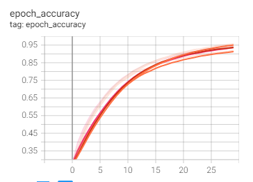
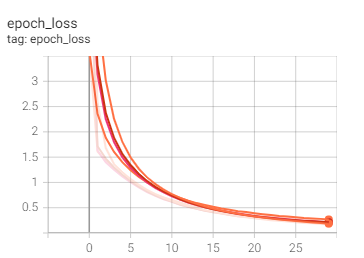
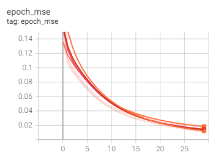

2. Confusion matrix
We keep track of each model performance our algorithm proposes on the testing portion of the dataset, so we can
track the progress over time.

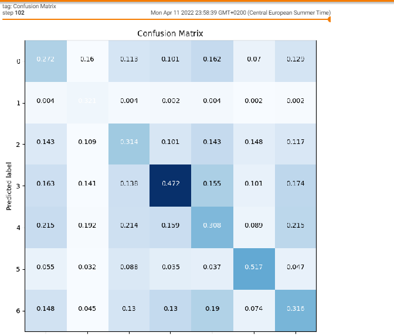

3. Histograms & distributions of neural network weights and biases

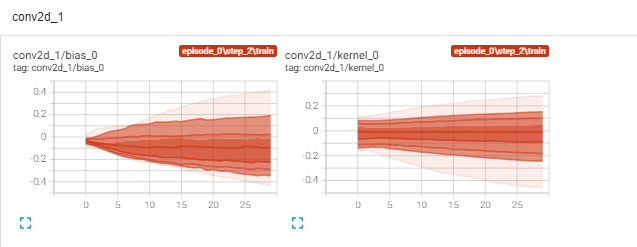
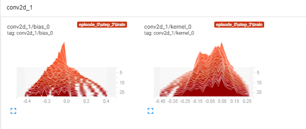

4. Hyper parameters 
This helps to see which combinations of our actions resulted in the best accuracy on the `test` dataset, not while
training as in the first point which is while `training`.

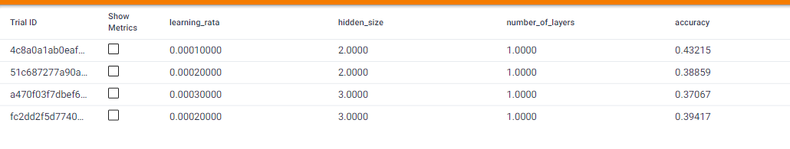
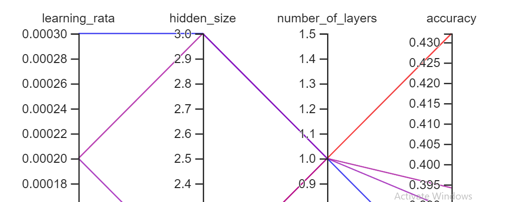

5. Detailed projector reports
Here we have different reports like what was more exhausting on hardware, what should we do to improve our model,
what part of the neural network is most exhausting the algorith etc.

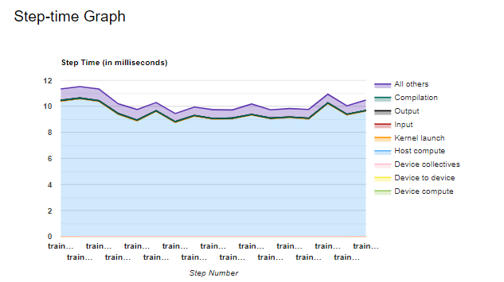
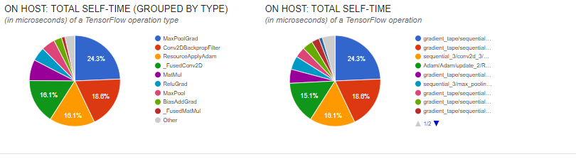
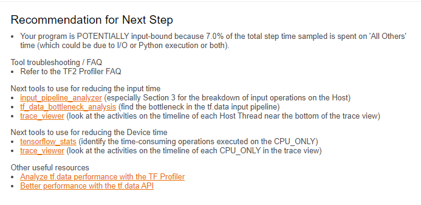

More details about concrete visualisations and their evaluation in the section about testing phases.